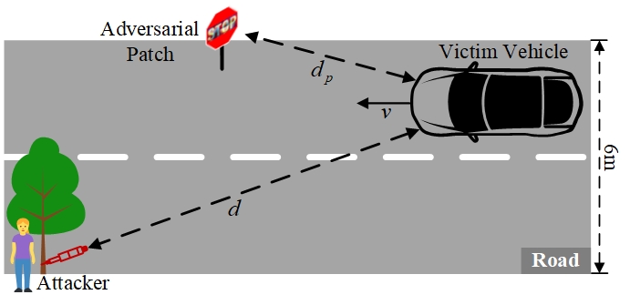
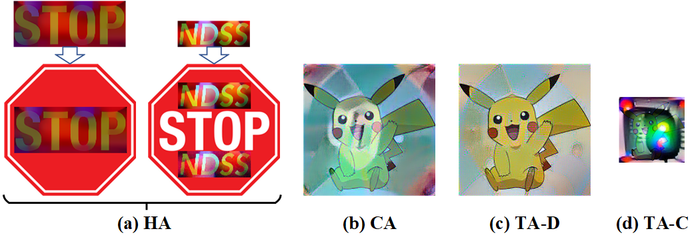

[//]: # (# L-HAWK: A Controllable Physical Adversarial Patch against A Long-Distance Target)

# Overview
Various demo videos can be found below：
* **Former Physical Evaluation:** [Demo](https://drive.google.com/drive/folders/1mjynOFPYJhn21ICtTHLcWKSS1iLRt_fy?usp=drive_link);
* **Various Speed Evaluation:** [20km/h](https://drive.google.com/file/d/1pCT5DwZXruUWitthEIKs1twKSASw-_z3/view?usp=drive_link), [30km/h](https://drive.google.com/file/d/1NUUeJyaEn7sfeUJ5Tm7cvM6fU5kYngV7/view?usp=drive_link), [40km/h](https://drive.google.com/file/d/1l_CiJlXZU9Du3nQukwN8phqcvvozIaYB/view?usp=drive_link), [50km/h](https://drive.google.com/file/d/17-vaRql2_X0ApOEBDIY1QuQxTU5rOuP6/view?usp=drive_link);
* **Laser Attack Operation:** [Demo](https://drive.google.com/file/d/1rWQc7dRmLPttoIXwfNVvRpHzsA4DiITm/view?usp=drive_link);
* **Driver's Perspective:** [Demo](https://drive.google.com/file/d/1p6-_SYJESE-c38Gwi0jfPP26ht7dM3r9/view?usp=drive_link);
* **End-to-End Evaluation:** [Demo](https://drive.google.com/file/d/1RsI3IyevvH-8N3G7eKsvM9zLDeEgOwOg/view?usp=drive_link).

The following is our supplement to rebuttal response.

# Revision Details

## R#26A

### R#26A-1: Unclear Attack Setup.

Figure 1: The spatial relationship in our physical attack setups.

Figure 2: The specific patches used in our evaluation.

### R#26A-2: Speed Limitations.
The attack video under various speeds can be found at [Demo](https://drive.google.com/file/d/17-vaRql2_X0ApOEBDIY1QuQxTU5rOuP6/view?usp=drive_link).

### R#26A-3: Unclear Definitions.
The specific patches are presented in [Figure 2](#r26a-1-unclear-attack-setup).

### R#26A-4: Laser Operation Limitations.
The laser attack operation video can be found at [Demo](https://drive.google.com/file/d/1rWQc7dRmLPttoIXwfNVvRpHzsA4DiITm/view?usp=drive_link).

### R#26A-5: Stealthiness of the Attack.

We show our stealthy patches in [Figure 2](#r26a-1-unclear-attack-setup) and the clear comparison in the below table.

| Previous Study | PhysGan[a] (CVPR20) | SLAP[b] (Usenix21) | AoR[c] (Usenix24) | FINE[d] (ICLR24) | IR[e] (NDSS24) | TPatch[f] (Usenix23) | Ours       |
| :------------: |:--------------------|:------------------:|:-----------------:|:----------------:|:--------------:|:--------------------:| :--------: |
| Patch Size     | 122cm×183cm         |     60cm×60cm      |     50cm×50cm     |   200cm×200cm    |   60cm×60cm    |      60cm×60cm       | 60cm×60cm  |

[a] Physgan: Generating Physical World-Resilient Adversarial Examples for Autonomous Driving.\
[b] Slap: Improving Physical Adversarial Examples With Short-Lived Adversarial Perturbations.\
[c] Adversary Is on the Road: Attacks on Visual Slam Using Unnoticeable Adversarial Patch.\
[d] Fusion Is Not Enough: Single Modal Attacks on Fusion Models for 3D Object Detection.\
[e] Invisible Reflections: Leveraging Infrared Laser Reflections to Target Traffic Sign Perception\
[f] Tpatch: A Triggered Physical Adversarial Patch.

## R#26B

### R#26B-1: Design Clarifications.

**1) Patch Definitions:** Clearer definition of patches is show in [Figure 2](#r26a-1-unclear-attack-setup)

## R#26C

### R#26C-1: Stealthiness.

We show the video of driver's perspective in [Demo](https://drive.google.com/file/d/1p6-_SYJESE-c38Gwi0jfPP26ht7dM3r9/view?usp=drive_link).
Extra physical evaluation videos in outdoor environment are available in [Demo](https://drive.google.com/file/d/17-vaRql2_X0ApOEBDIY1QuQxTU5rOuP6/view?usp=drive_link).

### R#26C-2: More experiments/Discussion Needed.

**2) Speed Limitations:** The attack video under various speeds can be found at [Demo](https://drive.google.com/file/d/17-vaRql2_X0ApOEBDIY1QuQxTU5rOuP6/view?usp=drive_link).

**3) Inadequate Countermeasures:** We present the defense results of adversarial training, input-transformation defense, and patch detectors.
mAP (mean Average-Precision) indicate the model's performance.

|          Defence Method          | ASR(Before Defence) | ASR(After Defence) | mAP(Before Defence) | mAP(After Defence) |
|:--------------------------------:| :-----------------: | :----------------: | :-----------------: | :----------------: |
| Adversarial Training[g] (ICCV19) | 94\.4%              | 41\.6%             | 45\.4               | 34\.5              |
| Input-Transformation[h] (CCS17)  | 94\.4%              | 68\.6%             | 45\.4               | 28\.8              |

[g] Towards Adversarially Robust Object Detection\
[h] Magnet: A Two-Pronged Defense Against Adversarial Examples

|       Patch Detector        | Before Defence (without attack) | Before Defence (with attack) | After Defence (without attack) | After Defence (with attack) |
|:---------------------------:| :-----------------------------: | :--------------------------: | :----------------------------: | :-------------------------: |
|     SentiNet[i] (S&P20)     | 100%                            | 85\.1%                       | 97\.5%                         | 0\.6%                       |
|  PatchGuard[j] (Usenix21)   | 100%                            | 96\.9%                       | 95\.3%                         | 0\.0%                       |
| PatchCleanser[k] (Usenix22) | 100%                            | 85\.4%                       | 96\.2%                         | 1\.0%                       |

[i] Sentinet: Detecting Localized Universal Attacks Against Deep Learning Systems\
[j] Patchguard: A Provably Robust Defense Against Adversarial Patches via Small Receptive Fields and Masking\
[k] Patchcleanser: Certifiably Robust Defense Against Adversarial Patches for Any Image Classifier

### R#26C-3: Ethical Responsibilities.

Please see R#26D-1 for details.

## R#26D

### R#26D-1: Ethical Concerns.

**Ethical Concerns:**
To prevent any real-world harm to vision-based perception systems or related infrastructure, and to comply with ethical and safety standards, we collaborate closely with the safety committee and take every precaution in our research.
First, following established protocols [l-m], all experiments are conducted on our autonomous vehicle hardware in a strictly controlled environment, with no interaction with public traffic or roadways.
Second, we have responsibly disclosed the identified security vulnerability to the relevant vendors, providing detailed technical information.
To reduce the risk of misuse, we have deliberately withheld specific details about the implementation of the laser attack equipment, such as the use of a Raspberry Pi to control the laser diode.
Finally, in Appendix VII, we discuss defense strategies that manufacturers and developers can implement to safeguard autonomous vehicle systems against laser-based attacks.

[l] Rolling Colors: Adversarial Laser Exploits against Traffic Light Recognition\
[m] They See Me Rollin’: Inherent Vulnerability of the Rolling Shutter in CMOS Image Sensors\
[n] Invisible Perturbations: Physical Adversarial Examples Exploiting the Rolling Shutter Effect

### R#26D-2: Safety Limitations.

The attack video under various speeds can be found at [Demo](https://drive.google.com/file/d/17-vaRql2_X0ApOEBDIY1QuQxTU5rOuP6/view?usp=drive_link).

### R#26D-3: End-to-End Evaluation.

The attack demo is available in [Demo](https://drive.google.com/file/d/1RsI3IyevvH-8N3G7eKsvM9zLDeEgOwOg/view?usp=drive_link).

### R#26D-4: Defense Evaluation.

We test five SOTA defence methods against our attacks and present the results in [Table](#r26c-2-more-experimentsdiscussion-needed).

### R#26D-5: Transferability.

We present some review literature on adversarial transferability as below:

[o] A Survey on Transferability of Adversarial Examples Across Deep Neural Networks\
[p] Defense strategies for Adversarial Machine Learning: A survey\
[q] Adversarial Attacks and Defenses in Machine Learning-Empowered Communication Systems and Networks: A Contemporary Survey\
[r] Interpreting Adversarial Examples in Deep Learning: A Review